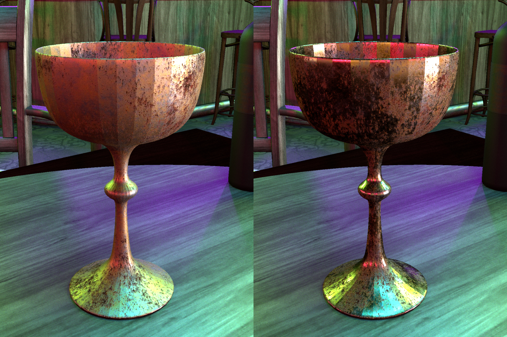

# Parameter-space ReSTIR for Differentiable and Inverse Rendering

<div align="center">
    
</div>

This repo contains the Mitsuba 3 implementation for the SIGGRAPH 2023 paper
[Parameter-space ReSTIR for Differentiable and Inverse Rendering](https://weschang.com/publications/restir-dr/). See the webpage for the paper and some intuition on how
the method works.

The algorithm accelerates inverse rendering in complex direct lighting scenarios by reusing samples
from previous iterations in gradient descent.
In this implementation, we support optimization of Disney Principled BRDF textures.

## Building and running
Check out the Mitsuba 3 [readme](https://github.com/mitsuba-renderer/mitsuba3) and
[docs](https://mitsuba.readthedocs.io/en/stable/src/developer_guide/compiling.html) for instructions
on compiling the project.

Please note that only the `cuda_ad_rgb` variant is supported and the project requires at least an NVIDIA
Turing GPU (e.g. RTX 2000 series+) to run.

See various notebooks in `notebooks/` for examples on running inverse rendering experiments.

## Important files
* [src/python/python/ad/integrators/restir_dr.py](src/python/python/ad/integrators/restir_dr.py):
    Implementation of the differentiable rendering algorithm
* [include/mitsuba/core/reservoir.h](include/mitsuba/core/reservoir.h):
    Implementation of the parameter-space reservoir data structure
* [ext/drjit/ext/drjit-core/src/op.cpp](ext/drjit/ext/drjit-core/src/op.cpp):
    Contains the Dr.Jit reservoir sampling algorithm for the CUDA backend
* [tools/reservoir_sampling/](tools/reservoir_sampling/):
    Contains the CUDA implementation of the reservoir sampling algorithm,
    and contains a CMake file to compile it to PTX for use in Dr.Jit
* [notebooks/](notebooks/):
    Various python notebooks used to run the experiments in the paper and supplemental material

## Citation

```bibtex
@inproceedings{Chang2023ReSTIRDiffRender,
  title = {Parameter-space ReSTIR for Differentiable and Inverse Rendering},
  author = {Chang, Wesley and Sivaram, Venkataram and Nowrouzezahrai, Derek and
  Hachisuka, Toshiya and Ramamoorthi, Ravi and Li, Tzu-Mao},
  booktitle = {ACM SIGGRAPH 2023 Conference Proceedings},
  numpages = {10},
  year = {2023},
  publisher = {Association for Computing Machinery},
  address = {New York, NY, USA},
  location = {Los Angeles, CA, USA},
  series = {SIGGRAPH '23},
  url = {https://doi.org/10.1145/3588432.3591512},
  doi = {10.1145/3588432.3591512}
}
```
